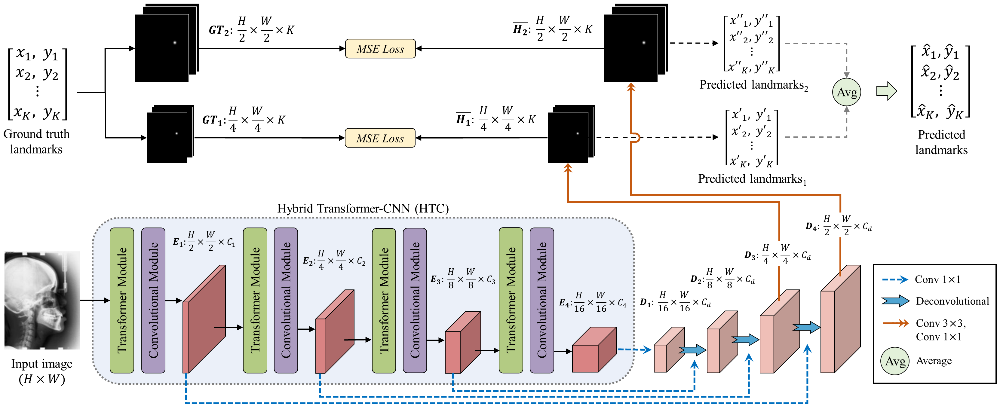
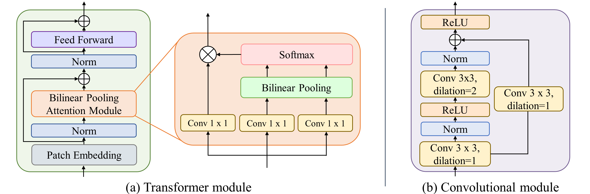
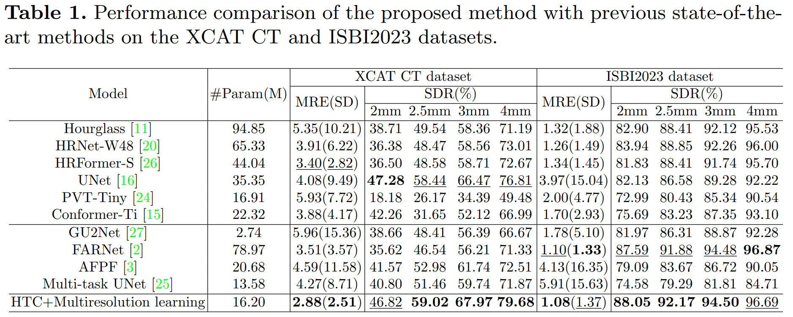
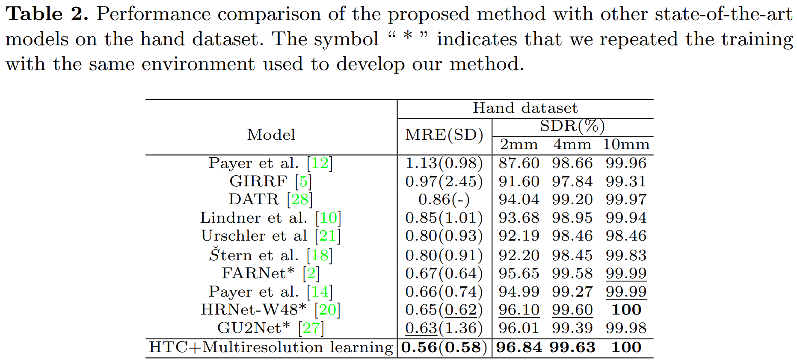

# Anatomical Landmark Detection Using a Multiresolution Learning Approach with a Hybrid Transformer-CNN Model (MICCAI 2023)


**This is the official pytorch implementation repository of our Anatomical Landmark Detection Using a Multiresolution Learning Approach with a Hybrid Transformer-CNN Model framework**: https://github.com/seriee/Multiresolution-HTC.git

## Abstract
Accurate localization of anatomical landmarks has a critical role in clinical diagnosis, treatment planning, and research. Most existing deep learning methods for anatomical landmark localization rely on heatmap regression-based learning, which generates label representations as 2D Gaussian distributions centered at the labeled coordinates of each of the landmarks and integrates them into a single spatial resolution heatmap. However, the accuracy of this method is limited by the resolution of the heatmap, which restricts its ability to capture finer details. In this study, we introduce a multiresolution heatmap learning strategy that enables the network to capture semantic feature representations precisely using multiresolution heatmaps generated from the feature representations at each resolution independently, resulting in improved localization accuracy. Moreover, we propose a novel network architecture called hybrid transformer-CNN (HTC), which combines the strengths of both CNN and vision transformer models to improve the network's ability to effectively extract both local and global representations. 
Extensive experiments demonstrated that our approach outperforms state-of-the-art deep learning-based anatomical landmark localization networks on the numerical XCAT 2D projection images and two public X-ray landmark detection benchmark datasets.

## Hybrid Transformer-CNN (HTC) with Multiresolution Learning
<div align="center">
  
</div>


## Hybrid Transformer-CNN (HTC) Architecture
<div align="center">
  
</div>

## Dataset
- We have used the following datasets:
  - **4D XCAT Head CBCT dataset**: Segars, W.P., Sturgeon, G., Mendonca, S., Grimes, J., Tsui, B.M.: 4d xcat phantom for multimodality imaging research. Medical physics 37(9), 4902–4915 (2010)
  - **ISBI2023 challenge dataset**: Anwaar Khalid, M., Zulfiqar, K., Bashir, U., Shaheen, A., Iqbal, R., Rizwan, Z., Rizwan, G., Moazam Fraz, M.: Cepha29: Automatic cephalometric landmark detection challenge 2023. arXiv e-prints pp. arXiv–2212 (2022)
  - **Hand X-ray dataset**: Payer, C., ˇStern, D., Bischof, H., Urschler, M.: Integrating spatial configuration into heatmap regression based CNNs for landmark localization. Medical Image Analysis 54, 207–219 (2019)

## Results
<div align="center">
  
</div>
<div align="center">
  
</div>

## Prerequesites
- Python 3.7
- MMpose 0.23

## Usage of the code
- **Dataset preparation**
  - The dataset structure should be in the following structure:

  ```
  Inputs: .PNG images and JSON file
  └── <dataset name>
      ├── 2D_images
      |   ├── 001.png
      │   ├── 002.png
      │   ├── 003.png
      │   ├── ...
      |
      └── JSON
          ├── train.json
          └── test.json
 ```

**Example json format:**
 {
    "images": [
        {
            "id": 0,
            "file_name": "0.png",
            "height": 420,
            "width": 620
        },
        ...
     ],
     "annotations": [
        {
            "image_id": 0,
            "id": 0,
            "category_id": 1,
            "keypoints": [
                604.5070198755171,
                289.1590783982888,
                2,
                592.8121081534473,
                261.62600827462876,
                2,
                428.0154934462112,
                301.24809471563935,
                2,
                604.9223114040644,
                234.45993184950234,
                2,
                570.296873380625,
                182.90429052972533,
                2,
                456.97751121306436,
                208.8105499707776,
                2,
                369.95414168150415,
                239.07609878665616,
                2,
                307.83364934785106,
                229.91052362204155,
                2,
                373.5995213621739,
                353.599939601835,
                2,
                499.50552505239256,
                453.1111418891231,
                2,
                493.50543334239256,
                456.12341418891231,
                2
            ],
            "num_keypoints": 11,
            "iscrowd": 0
        },
        ...
 ]
 ```
    
  - Output: 2D landmark coordinates

- **Train the model**
  - To train our HTC model with a multiresolution learning approach, run **sh train.sh**:
  ```
  # sh train.sh
  CUDA_VISIBLE_DEVICES=gpu_ids PORT=PORT_NUM ./tools/dist_train.sh \
  config_file_path num_gpus
  ```

- **Evaluation**
  - To evaluate the trained HTC model, run **sh test.sh**:
  ```
  # sh test.sh
  CUDA_VISIBLE_DEVICES=gpu_id PORT=29504 ./tools/dist_test.sh config_file_path \
      model_weight_path num_gpus \
      # For evaluation of the Head XCAT dataset, use:
      --eval 'MRE_h','MRE_std_h','SDR_2_h','SDR_2.5_h','SDR_3_h','SDR_4_h'
      # For evaluation of ISBI2023 and Hand X-ray dataset, use:
      # --eval 'MRE_i2','MRE_std_i2','SDR_2_i2','SDR_2.5_i2','SDR_3_i2','SDR_4_i2'
  ```

### Author
Thanaporn Viriyasaranon, Serie Ma, and Jang-Hwan Choi

### Citation 
Viriyasaranon, T., Ma, S., Choi, JH. (2023). Anatomical Landmark Detection Using a Multiresolution Learning Approach with a Hybrid Transformer-CNN Model. In: Greenspan, H., et al. Medical Image Computing and Computer Assisted Intervention – MICCAI 2023. MICCAI 2023. Lecture Notes in Computer Science, vol 14225. Springer, Cham. https://doi.org/10.1007/978-3-031-43987-2_42
