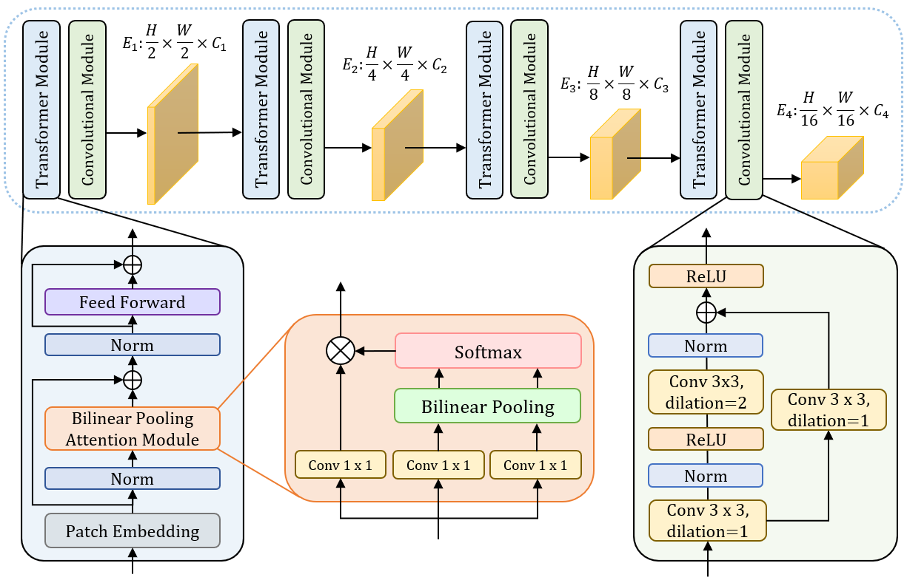

**Pytorch implementation of our Anatomical Landmark Detection Using a Multiresolution Learning Approach with a Hybrid Transformer-CNN Model framework.
**https://github.com/seriee/Multiresolution-Learning-based-Hybrid-Transformer-CNN-Model-for-Anatomical-Landmark-Detection

## Abstract
Accurate localization of anatomical landmarks has a critical role in clinical diagnosis, treatment planning, and research. Most existing
deep learning methods for anatomical landmark localization rely on heatmap regression-based learning, which generates label representations
as 2D Gaussian distributions centered at the labeled coordinates of each of the landmarks and integrates them into a single spatial resolution
heatmap. However, the accuracy of this method is limited by the resolution of the heatmap, which restricts its ability to capture finer details. In
this study, we introduce a multiresolution heatmap learning strategy that enables the network to capture semantic feature representations precisely
using multiresolution heatmaps generated from the feature representations at each resolution independently, resulting in improved localization
accuracy. Moreover, we propose a novel network architecture called hybrid transformer-CNN (HTC), which combines the strengths of both
CNN and vision transformer models to improve the network’s ability to effectively extract both local and global representations. We evaluated
our approach on the numerical XCAT 2D projection images and two public X-ray landmark detection benchmark datasets. Extensive experiments
demonstrated that our approach outperforms state-of-the-art deep learning-based anatomical landmark localization networks.

## Hybrid Transformer-CNN Model with Multiresolution Learning Approach
<div align="center">
  
</div>


## Hybrid Transformer-CNN Architecture
<div align="center">
  
</div>

## Dataset
- We have used three datasets mentioned from the papers below.
  - Head XCAT dataset: Segars, W.P., Sturgeon, G., Mendonca, S., Grimes, J., Tsui, B.M.: 4d xcat phantom for multimodality imaging research. Medical physics 37(9), 4902–4915 (2010)
  - Hand X-ray dataset: Payer, C., ˇStern, D., Bischof, H., Urschler, M.: Integrating spatial configuration into heatmap regression based CNNs for landmark localization. Medical Image Analysis 54, 207–219 (2019)
  - ISBI2023 challenge dataset: Anwaar Khalid, M., Zulfiqar, K., Bashir, U., Shaheen, A., Iqbal, R., Rizwan, Z., Rizwan, G., Moazam Fraz, M.: Cepha29: Automatic cephalometric landmark detection challenge 2023. arXiv e-prints pp. arXiv–2212 (2022)
- Input: .PNG images and JSON file

## Prerequesites
- Python 3.7
- MMpose 0.23

## Usage
- Train
  - To train the HTC model with multiresolution learning approach, run the following command.
  ```
  sh train.sh
  ```
  - The content of the code in the respective file(train.sh) will be:
  ```
  CUDA_VISIBLE_DEVICES=gpu_ids PORT=PORT_NUM ./tools/dist_train.sh \
  config_file_path num_gpus
  ```

- Test
  - To test the trained HTC model, run the following command.
  ```
  sh test.sh
  ```
  - The content of the code in the respective file(test.sh) will be:
  ```
  CUDA_VISIBLE_DEVICES=gpu_id PORT=29504 ./tools/dist_test.sh config_file_path \
      model_weight_path num_gpus \
      # for evaluation of the Head XCAT dataset, use:
      --eval 'MRE_h','MRE_std_h','SDR_2_h','SDR_2.5_h','SDR_3_h','SDR_4_h'
      # for evaluation of ISBI2023 and Hand X-ray dataset, use:
      # --eval 'MRE_i2','MRE_std_i2','SDR_2_i2','SDR_2.5_i2','SDR_3_i2','SDR_4_i2'
  ```
  - Output: 2D landmark coordinates

## Citation 
If you find this code useful for your research, please kindly cite our paper. Citation of our paper will be updated.
